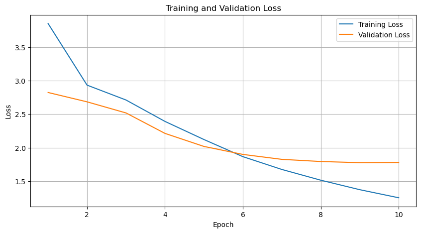
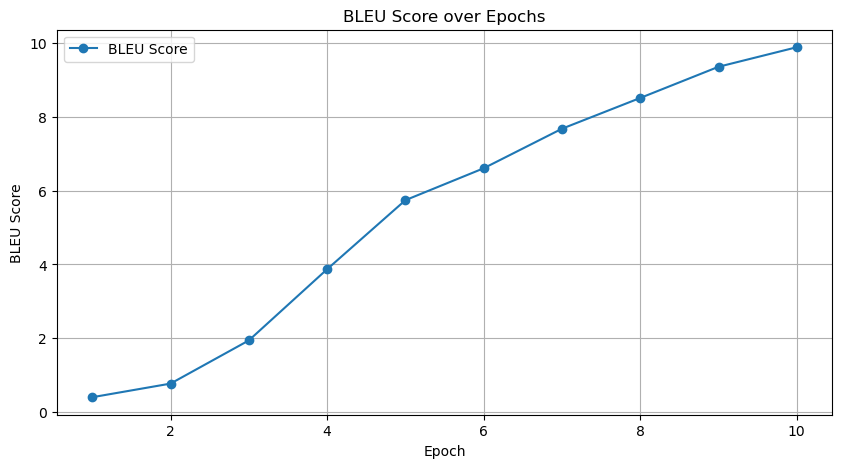
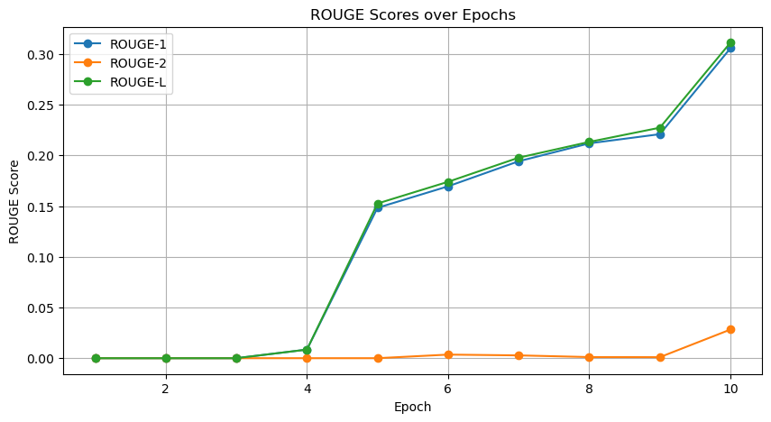
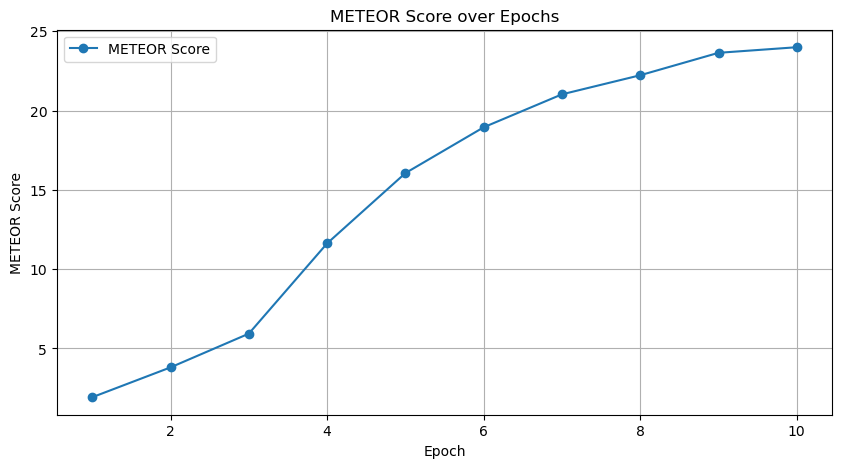
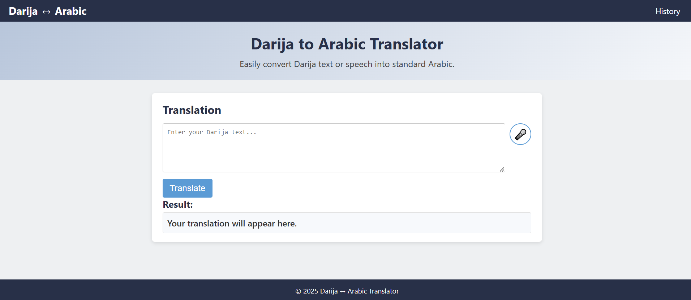
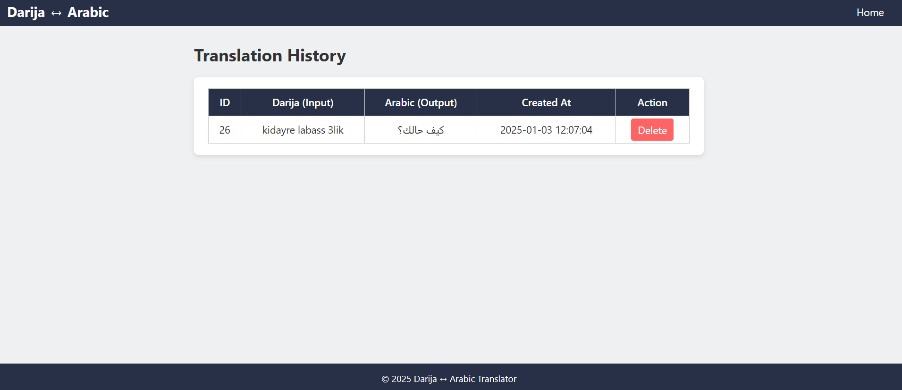

# Darija to Arabic Translation Using mT5

## Table of Contents

1. [Project Overview](#project-overview)  
2. [Dataset](#dataset)  
3. [Data Preprocessing](#data-preprocessing)  
4. [Model Details](#model-details)  
5. [Training Process](#training-process)  
6. [Evaluation Metrics & Results](#evaluation-metrics--results)  
7. [Visualizations](#visualizations)  
8. [Flask Web Application](#flask-web-application)  
   - [Features](#features)  
   - [Usage](#usage)  
   - [Screenshot](#screenshot)  

---

## Project Overview

This project focuses on **translating Moroccan Darija** into **Standard Arabic** using a fine-tuned **mT5 model**.  
Darija, a Moroccan dialect of Arabic, differs significantly from Standard Arabic in terms of vocabulary, grammar, and pronunciation. By leveraging the capabilities of the mT5 model, this project aims to bridge the linguistic gap, providing accurate and reliable translations from Darija to Arabic.

The repository comprises two main components:

1. **Training Notebook**: Demonstrates data preprocessing, model fine-tuning, and evaluation.  
2. **Flask Web Application**: Offers a user-friendly interface for real-time translation, including voice input and translation history management.

---

## Dataset

- **Columns**:
  - `darija`: Contains text in Moroccan Darija.
  - `arabic`: Contains corresponding translations in Standard Arabic.

**Dataset Characteristics**:
- **Size**: The dataset comprises 47,185 Darija-Arabic sentence pairs.  
- **Quality**: Data has been meticulously cleaned to ensure accuracy and consistency.

---

## Data Preprocessing

Effective preprocessing is crucial for enhancing model performance. The preprocessing steps undertaken include:

1. **Data Cleaning**:
   - **Removal of Missing Values**: Rows with empty `darija` or `arabic` fields are excluded to maintain data integrity.
   - **Deduplication**: Duplicate sentence pairs are removed to prevent the model from overfitting on repeated data.
   - **Normalization**: Text is standardized to ensure uniformity across the dataset.

2. **Task Prefixing**:
   - Each input sentence in Darija is prefixed with `"translate darija to arabic: "` to guide the mT5 model in understanding the translation task.

3. **Train-Validation Split**:
   - The dataset is divided into training and validation sets (e.g., 90% training, 10% validation) to evaluate model performance effectively.

4. **Tokenization**:
   - Utilizing the mT5 tokenizer, both Darija and Arabic texts are tokenized, converting words into numerical representations suitable for model training.

---

## Model Details

- **Base Model**: [Google's mT5-base](https://huggingface.co/google/mt5-base)  
- **Architecture**: mT5 is a multilingual variant of the T5 model, designed to handle multiple languages simultaneously.  

**Fine-Tuning**:
- The mT5-base model is fine-tuned on the Darija-Arabic dataset to specialize it for the translation task.
- **Hyperparameters**:
  - **Epochs**: 10
  - **Learning Rate**: 1e-4
  - **Batch Size**: 4 (training and validation)
  - **Max Sequence Length**: 128 tokens for both source and target

- **Optimizer**: AdamW optimizer is employed to adjust the model's weights during training effectively.

---

## Training Process

The training process is meticulously designed to optimize the model's translation capabilities:

1. **Initialization**:
   - The mT5 model and tokenizer are loaded and configured.
   - Random seeds are set to ensure reproducibility.

2. **Training Loop**:
   - The model undergoes multiple epochs of training, where it learns to map Darija inputs to their Arabic translations.
   - In each epoch, the model processes batches of data, computes loss, backpropagates errors, and updates weights.

3. **Validation**:
   - After each training epoch, the model's performance is evaluated on the validation set.
   - This helps in monitoring overfitting and ensuring generalization.

4. **Checkpointing**:
   - Model weights are periodically saved, allowing for recovery in case of interruptions and enabling future inference tasks.

---

## Evaluation Metrics & Results

To assess the model's translation quality, several evaluation metrics are employed:

- **BLEU (Bilingual Evaluation Understudy)**: Measures the correspondence between machine and human translations.  
- **ROUGE (Recall-Oriented Understudy for Gisting Evaluation)**:
  - **ROUGE-1**: Overlap of unigrams.
  - **ROUGE-2**: Overlap of bigrams.
  - **ROUGE-L**: Longest common subsequence.  
- **METEOR**: Considers synonymy and stemming for a more flexible evaluation.  
- **chrF**: Character n-gram F-score.  

---

## Visualizations

### Training & Validation Loss

### BLEU Score Over Epochs

### ROUGE Scores Over Epochs

### METEOR and chrF Scores

---

## Flask Web Application

A **Flask-based web application** provides an interactive interface for translating Darija to Arabic.  

### Features

- **Text Input**: Users can manually enter Darija text into a spacious textarea.  
- **Voice Input**: Utilizes the Web Speech API to capture spoken Darija, converting it to text for translation.  
- **Real-Time Translation**: Translates input text instantly, displaying the Arabic output.  

---

### Screenshot

